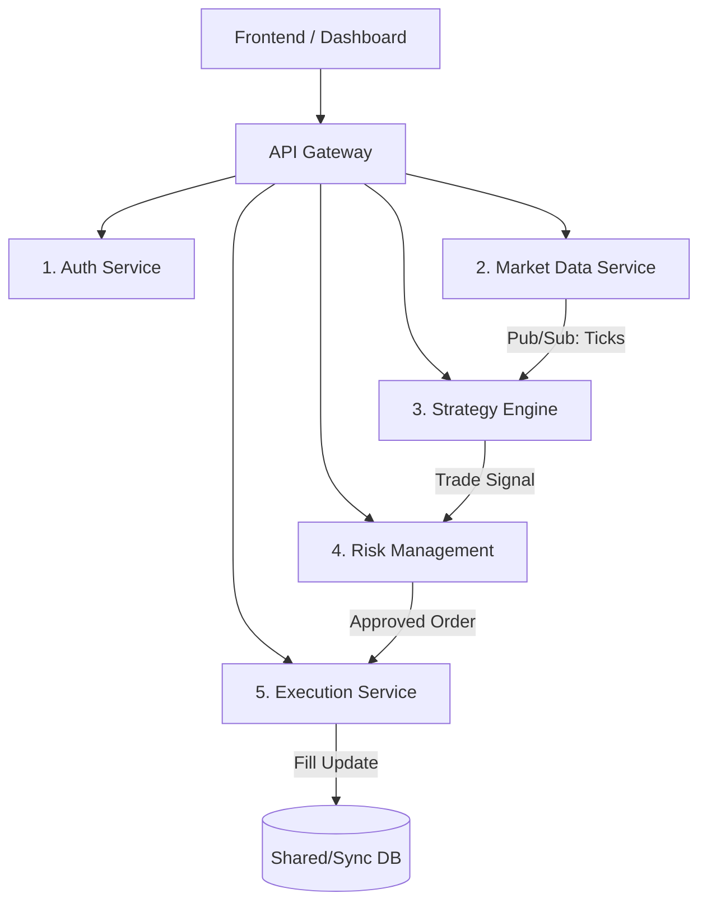

# DayTradingPaperBot Microservices Transformation Plan

## 1. Executive Summary
Moving from the current Monolithic Streamlit application to a Microservices architecture will improve scalability, fault isolation, and development velocity. The system will be split into **5 Core Services** communicating via REST APIs (for synchronous actions) and a Message Queue (for asynchronous events like market ticks).

## 2. Proposed Architecture Diagram

## 3. Detailed Service Breakdown

### Service 1: Authentication Service (`auth-service`)
**Responsibility**: Manages Zerodha user sessions, API tokens, and local user access.
*   **Core Logic**: `zerodha_auth.py`
*   **Database**: Redis (for Token storage/expiry)
*   **Endpoints**:
    *   `POST /auth/login`: Initiate Zerodha login flow.
    *   `POST /auth/callback`: Handle Zerodha redirect & exchange token.
    *   `GET /auth/status`: Check if session is valid.
    *   `POST /auth/refresh`: Refresh daily access tokens.

### Service 2: Market Data Service (`market-data-service`)
**Responsibility**: Connects to Zerodha Websockets, fetches OHLC, and manages the "Scanner" logic. It is the "Source of Truth" for price.
*   **Core Logic**: `market_data.py`, `market_scanner.py`
*   **Database**: TimescaleDB or InfluxDB (for Time-series data).
*   **Endpoints**:
    *   `GET /market/quote/{symbol}`: Get real-time LTP/Depth.
    *   `GET /market/ohlc/{symbol}?interval=5min`: Get historical candles.
    *   `POST /market/scan`: Trigger a market scan (e.g., "Emerging Stocks").
    *   `WS /ws/ticks`: Websocket endpoint streaming live prices to other services.

### Service 3: Strategy & Intelligence Service (`strategy-service`)
**Responsibility**: Runs technical analysis, executes logic (Momentum/MeanReversion), and uses LLM for sentiment validation.
*   **Core Logic**: `strategy_engine.py`, `llm.py`
*   **Inputs**: Subscribes to `market-data-service` streams.
*   **Endpoints**:
    *   `POST /strategy/analyze`: specific analysis for a symbol (HITL).
    *   `POST /strategy/backtest`: Run backtest on historical data.
    *   `PUT /strategy/{name}/config`: Update parameters (e.g., RSI threshold).
    *   `GET /strategy/signals`: Get recent generated signals.

### Service 4: Risk Management Service (`risk-service`)
**Responsibility**: The "Gatekeeper". Validates every trade against capital limits, max loss, and wash trading rules.
*   **Core Logic**: `risk_engine.py`
*   **Database**: PostgreSQL (Relational state: `daily_pnl`, `max_drawdown`).
*   **Endpoints**:
    *   `POST /risk/validate`: Input: `TradeIntent`. Output: `Approved/Rejected`.
    *   `GET /risk/status`: Current P&L, Remaining Capital, Safe Mode status.
    *   `POST /risk/update_pnl`: Callback from Execution service when trade closes.
    *   `POST /risk/halt`: Manual kill switch.

### Service 5: Order Execution Service (`execution-service`)
**Responsibility**: Final executor. Matches internal "Paper" orders or routes "Live" orders to Zerodha.
*   **Core Logic**: `paper_broker.py`, `execution_engine.py` (future).
*   **Database**: SQLite/PostgreSQL (Order Book & Ledger).
*   **Endpoints**:
    *   `POST /orders/place`: Place a validated order.
    *   `POST /orders/cancel/{id}`: Cancel order.
    *   `GET /orders/positions`: Get currently open positions.
    *   `GET /orders/history`: Tradebook.

## 4. Technology Stack Recommendation

| Component | Technology | Reasoning |
| :--- | :--- | :--- |
| **Language** | Python 3.11+ | Shared codebase, great for data/finance. |
| **Framework** | FastAPI | High performance, auto-OpenAPI docs, Async support. |
| **Communication** | REST (HTTP) + Redis Pub/Sub | REST for commands, Pub/Sub for high-frequency market data. |
| **Database (Relational)** | PostgreSQL | Robust for ledger, user state, and risk logs. |
| **Database (Time Series)** | TimescaleDB | Efficiently storing OHLC and Tick data. |
| **Cache** | Redis | Storing auth tokens and "Hot" market prices. |
| **Frontend** | Next.js or Streamlit (Decoupled) | Streamlit is fine for internal tools; Next.js for pro UI. |
| **Deployment** | Docker Compose / K8s | Standard containerization. |

## 5. Migration Roadmap

### Phase 1: Decouple Logic (Current Sprint)
*   Ensure `market_data.py` calculates signals but does NOT manipulate global state directly.
*   Ensure `risk_engine.py` is a pure function/class that returns Yes/No based on inputs, rather than reading global variables.

### Phase 2: API Gateway Wrapper
*   Wrap the existing modules in a single **FastAPI** application (`app/main.py`).
*   The Streamlit dashboard should stop importing `app.core` directly and start making HTTP `requests.get()` calls to `localhost:8000`.

### Phase 3: Split Services (Physical Separation)
*   Move `market_data` logic to its own Docker container.
*   Move `risk_engine` logic to its own Docker container.
*   Implement Redis for communication between them.

## 6. Endpoints Summary (Total ~18)
1. `Auth`: 4 endpoints
2. `Market`: 4 endpoints
3. `Strategy`: 4 endpoints
4. `Risk`: 4 endpoints
5. `Execution`: 4 endpoints

This modular approach allows you to upgrade the **Strategy Engine** (e.g., adding complex AI models) without risking the stability of the **Order Execution** or **Risk** systems.
