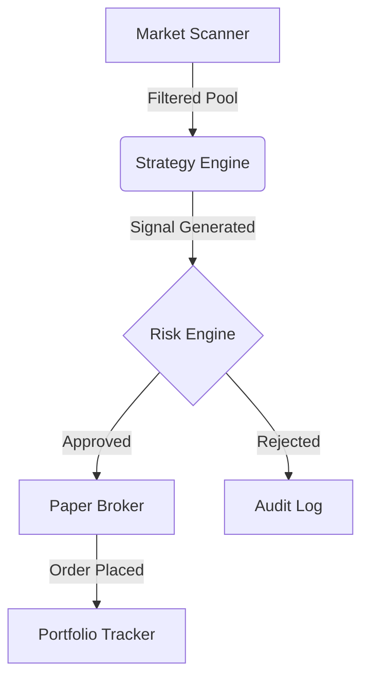

# Day Trading Paper Bot - V3 Documentation

## 1. System Overview
**Project**: Zerodha-based Day Trading Paper Bot (Emerging Low-Cost Stocks Focus)
**Goal**: Identify and paper-trade emerging stocks (₹20-₹300) while strictly excluding large caps.
**Mode**: **Paper Trading Only**.

## 2. Architecture & Data Flow
The system follows a strict decision pipeline. No trade is placed without passing through all gates.

### Components
1.  **Market Scanner** (`app/core/market_scanner.py`)
    *   **Filters**: Price ₹20-300, M-Cap ₹300Cr-5000Cr.
    *   **Exclusions**: NIFTY 50, BANK NIFTY.
    *   **Logic**: Checks Volume, Delivery %, and Revenue Growth.
2.  **Strategy Engine** (`app/core/strategy_engine.py`)
    *    Analyzes stocks from the scanner.
    *   **Strategy**: "Emerging Momentum" (Price > VWAP, Vol > 1.5x Avg, RSI > 55).
    *   Output: `TradeSignal` (Entry, SL, Target).
3.  **Risk Engine** (`app/core/risk_engine.py`)
    *   **Hard Guardrails**:
        *   Max Capital/Trade: ₹2,000
        *   Max Loss/Day: ₹200
        *   Max Trades/Day: 5
    *   **Halt**: Auto-stops trading if Daily Loss limit breached.
4.  **Paper Broker** (`app/core/paper_broker.py`)
    *   Simulates Zerodha orders.
    *   Applies 0.1% slippage.
    *   Calculates brokerage (approx. 0.03%).

## 3. Strategy Logic: Emerging Momentum
This strategy targets small-cap stocks showing sudden interest.
*   **Entry**:
    *   Use 5-min or 15-min candles.
    *   Current Price > VWAP.
    *   Volume > 1.5x Average (Volume Spike).
    *   RSI > 55 (Strong Momentum).
    *   Price > Previous Day High.
*   **Exit**:
    *   Target: 4%
    *   Stop Loss: 2%

## 4. User Guide
1.  **Launch**: `streamlit run ui/dashboard_v3.py`
2.  **Scanner**: Go to "Market Scanner" tab -> Click "Run Scan".
3.  **Analyze**: Click "Analyze [Stock]" on results.
4.  **Execute**: If Signal matches, click "Execute Paper Trade".
    *   *Note*: If trade value > ₹2000, Risk Engine will REJECT it.
5.  **Monitor**: Check "Portfolio" for open positions and P&L.
6.  **Reports**: View end-of-day performance.

## 5. File Structure
*   `ui/dashboard_v3.py` - Main Interface.
*   `app/core/market_scanner.py` - Filtration Logic.
*   `app/core/strategy_engine.py` - Signal Generation.
*   `app/core/risk_engine.py` - Risk Rules.
*   `app/core/paper_broker.py` - Trade Simulation.
